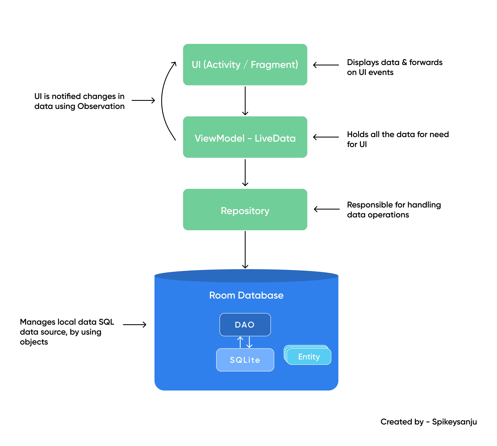

Yes, using Room means that the database files will be stored locally on the device, just like with SQLite. The data will persist between app sessions, and the database file is stored in the app's private storage (`/data/data/com.yourpackage/databases/`). This means that the data is not accessible by other apps unless the user explicitly exports it.

### Workflow for Adding an Expense Page
The process will involve the following steps:
1. Define the database entity (Expense).
2. Create the DAO (Data Access Object) interface for CRUD operations.
3. Set up the Room database configuration.
4. Implement a repository for data access.
5. Create a ViewModel to handle the business logic.
6. Design the UI (XML layout for the Add Expense page).
7. Set up the Activity and bind data to the UI using the ViewModel.

#### Communication with Room DB


#### Poznámky
- Definuje se entita (basically tabulka v db)
- DAO -> zpřístupní CRUD operace na dané entitě, používá zabudované ORM
- Repository - oddělí ORM od ViewModelu
- Activity = Page (interaction screen)

### 1. **Database Entity (Expense.kt)**
```kotlin
@Entity(tableName = "expenses")
data class Expense(
    @PrimaryKey(autoGenerate = true) val id: Long = 0,
    @ColumnInfo(name = "amount") val amount: Double,
    @ColumnInfo(name = "category") val category: String,
    @ColumnInfo(name = "note") val note: String?,
    @ColumnInfo(name = "timestamp") val timestamp: Long,
    @ColumnInfo(name = "payment_method") val paymentMethod: String
)
```

### 2. **DAO Interface (ExpenseDao.kt)**
```kotlin
@Dao
interface ExpenseDao {
    @Insert(onConflict = OnConflictStrategy.REPLACE)
    suspend fun insertExpense(expense: Expense)

    @Query("SELECT * FROM expenses ORDER BY timestamp DESC")
    fun getAllExpenses(): LiveData<List<Expense>>
}
```

### 3. **Room Database Configuration (AppDatabase.kt)**
```kotlin
@Database(entities = [Expense::class], version = 1, exportSchema = false)
abstract class AppDatabase : RoomDatabase() {
    abstract fun expenseDao(): ExpenseDao

    companion object {
        @Volatile
        private var INSTANCE: AppDatabase? = null

        fun getDatabase(context: Context): AppDatabase {
            return INSTANCE ?: synchronized(this) {
                val instance = Room.databaseBuilder(
                    context.applicationContext,
                    AppDatabase::class.java,
                    "walletwiz_database"
                ).build()
                INSTANCE = instance
                instance
            }
        }
    }
}
```

### 4. **Repository (ExpenseRepository.kt)**
```kotlin
class ExpenseRepository(private val expenseDao: ExpenseDao) {

    val allExpenses: LiveData<List<Expense>> = expenseDao.getAllExpenses()

    suspend fun insert(expense: Expense) {
        expenseDao.insertExpense(expense)
    }
}
```

### 5. **ViewModel (ExpenseViewModel.kt)**
```kotlin
class ExpenseViewModel(application: Application) : AndroidViewModel(application) {

    private val repository: ExpenseRepository
    val allExpenses: LiveData<List<Expense>>

    init {
        val expenseDao = AppDatabase.getDatabase(application).expenseDao()
        repository = ExpenseRepository(expenseDao)
        allExpenses = repository.allExpenses
    }

    fun insert(expense: Expense) = viewModelScope.launch {
        repository.insert(expense)
    }
}
```

### 6. **UI Layout (activity_add_expense.xml)**
```xml
<?xml version="1.0" encoding="utf-8"?>
<LinearLayout xmlns:android="http://schemas.android.com/apk/res/android"
    android:orientation="vertical"
    android:padding="16dp"
    android:layout_width="match_parent"
    android:layout_height="match_parent">

    <EditText
        android:id="@+id/editTextAmount"
        android:hint="Amount"
        android:inputType="numberDecimal"
        android:layout_width="match_parent"
        android:layout_height="wrap_content"/>

    <EditText
        android:id="@+id/editTextCategory"
        android:hint="Category"
        android:layout_width="match_parent"
        android:layout_height="wrap_content"/>

    <EditText
        android:id="@+id/editTextNote"
        android:hint="Note"
        android:layout_width="match_parent"
        android:layout_height="wrap_content"/>

    <RadioGroup
        android:id="@+id/radioGroupPaymentMethod"
        android:orientation="horizontal"
        android:layout_width="match_parent"
        android:layout_height="wrap_content">
        <RadioButton
            android:id="@+id/radioCash"
            android:text="Cash"
            android:layout_width="wrap_content"
            android:layout_height="wrap_content"/>
        <RadioButton
            android:id="@+id/radioCard"
            android:text="Card"
            android:layout_width="wrap_content"
            android:layout_height="wrap_content"/>
    </RadioGroup>

    <Button
        android:id="@+id/buttonSave"
        android:text="Save Expense"
        android:layout_width="match_parent"
        android:layout_height="wrap_content"/>
</LinearLayout>
```

### 7. **Add Expense Activity (AddExpenseActivity.kt)**
```kotlin
class AddExpenseActivity : AppCompatActivity() {

    private lateinit var expenseViewModel: ExpenseViewModel

    override fun onCreate(savedInstanceState: Bundle?) {
        super.onCreate(savedInstanceState)
        setContentView(R.layout.activity_add_expense)

        expenseViewModel = ViewModelProvider(this)[ExpenseViewModel::class.java]

        val editTextAmount = findViewById<EditText>(R.id.editTextAmount)
        val editTextCategory = findViewById<EditText>(R.id.editTextCategory)
        val editTextNote = findViewById<EditText>(R.id.editTextNote)
        val radioGroupPaymentMethod = findViewById<RadioGroup>(R.id.radioGroupPaymentMethod)
        val buttonSave = findViewById<Button>(R.id.buttonSave)

        buttonSave.setOnClickListener {
            val amount = editTextAmount.text.toString().toDoubleOrNull() ?: 0.0
            val category = editTextCategory.text.toString()
            val note = editTextNote.text.toString()
            val paymentMethod = if (radioGroupPaymentMethod.checkedRadioButtonId == R.id.radioCash) "cash" else "card"
            val timestamp = System.currentTimeMillis()

            val expense = Expense(
                amount = amount,
                category = category,
                note = note,
                timestamp = timestamp,
                paymentMethod = paymentMethod
            )

            expenseViewModel.insert(expense)
            Toast.makeText(this, "Expense saved!", Toast.LENGTH_SHORT).show()
            finish()
        }
    }
}
```

### Explanation:
1. **Entity**: Defines the table structure for the "expenses" table.
2. **DAO**: Provides methods for interacting with the database.
3. **Database**: Configures the Room database.
4. **Repository**: Acts as an intermediary between the DAO and ViewModel.
5. **ViewModel**: Manages UI-related data and business logic.
6. **UI Layout**: Defines the layout for adding an expense.
7. **Activity**: Handles user input and interacts with the ViewModel.